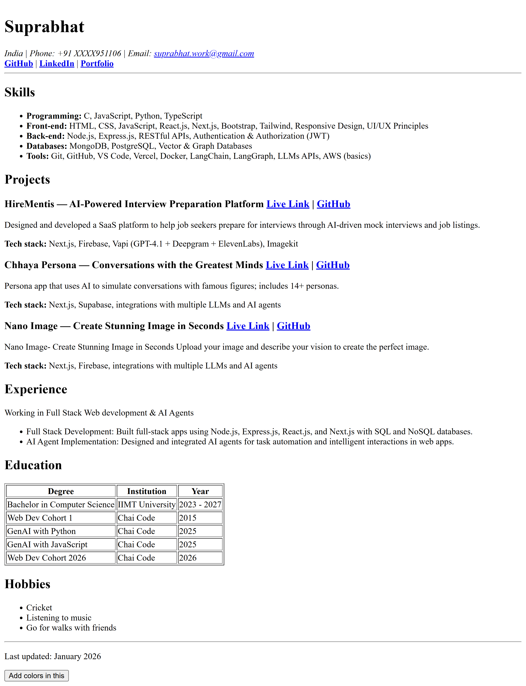

# HTML Resume Project

This repository contains a simple HTML-based resume project. It demonstrates the use of various HTML tags and includes a theme toggle feature implemented with JavaScript. This is a Part of Web Dev Cohort 2026.

## Demo Image

## Live Link

[🌐 View Live Resume](https://resume.suprabhat.site)

## File Structure

- `index.html`: The main HTML file containing the resume content.
#### Not part of the Assignment
- `scripts/theme-toggle.js`: JavaScript file for toggling between Basic HTML to HTML+CSS.

## Explanation of HTML Tags Used

Below is a list of HTML tags and attributes used in `index.html` and their purposes:

- `<html>`: The root element of the HTML document.
- `<!doctype html>`: Declares the document type and version of HTML.
- `<head>`: Contains metadata, links to stylesheets, and the page title.
- `<meta>`: Provides metadata such as character encoding and viewport settings.
- `<title>`: Sets the title of the web page (shown in the browser tab).
- `<body>`: Contains the visible content of the web page.
- `<header>`: Defines the header section, often containing the name and contact info.
- `<h1>`, `<h2>`, `<h3>`: Headings of various levels for section titles and subsections.
- `<address>`: Provides contact information for the author/owner of the document.
- `<social>`: Custom tag (not standard HTML) used here for grouping social links (for demonstration/semantic grouping only).
- `<a>`: Hyperlinks to email, phone, or external sites.
- `<b>`: Renders text in bold (used inside links for emphasis).
- `
`: Horizontal rule, used to visually separate content sections.
- `<main>`: The main content area, including sections like education, experience, and skills.
- `<section>`: Groups related content together (e.g., Skills, Projects, Experience, Education, Hobbies).
- `<ul>`, `<ol>`: Unordered and ordered lists for listing items such as skills or job duties.
- `<li>`: List items within `<ul>` or `<ol>`.
- `<strong>`: Indicates strong importance, typically rendered as bold text.
- `<article>`: Represents a self-contained composition (used for individual projects).
- ``: Used to group inline elements and apply styling or attributes.
- `
`: Paragraphs of text.
- `<table>`: Displays tabular data (used in Education section).
- `<tr>`: Table row.
- `<th>`: Table header cell.
- `<td>`: Table data cell.
- `<footer>`: Footer section, often containing copyright or contact info.
- `<button>`: Used for interactive elements like the theme toggle.
- `
`: Generic container for flow content, used for theme status.
- `<script>`: Links to JavaScript files (Not part of the assignment).

- `aria-labelledby`: An accessibility attribute used to reference the ID of another element that labels the current element. It helps assistive technologies (like screen readers) provide descriptive labels for sections and other elements, improving accessibility.(Nhi toh 40k$ ka case hota hai)

---

## Theme Toggle Feature
#### Not Not part of the Assignment

This project includes a theme toggle feature that allows users to switch between Basic HTML to HTML+CSS. The functionality is implemented in `scripts/theme-toggle.js` and can be triggered by clicking the theme toggle button on the page.

---

#### Thanks for reading this (gulabi dil)